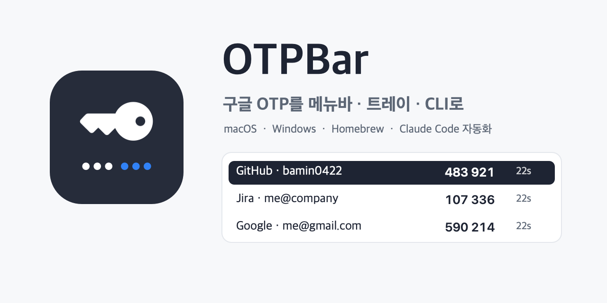

# OTPBar



구글 OTP(Google Authenticator)에 등록한 계정의 일회용 코드를 macOS 메뉴바와 Windows 트레이에서 바로 쓰는 도구입니다. 자동화 도구(Claude Code 등)를 위한 CLI도 함께 들어 있습니다.

```bash
brew install bamin0422/tap/otpbar                                             # macOS
irm https://raw.githubusercontent.com/bamin0422/otpbar/main/install.ps1 | iex # Windows
```

> **2.0의 변화** — 비밀키를 마스터 암호로 암호화한 금고에 보관합니다. 1.x는 운영체제 키체인에 평문 비밀키를 두었고, 같은 사용자 권한으로 도는 프로그램이면 무엇이든 읽을 수 있었습니다. 2.0은 그 경로를 없앴습니다. 자세한 내용은 [보안 모델](#보안-모델)에 있습니다.

## 무엇을 하나

- **메뉴바·트레이**: 계정별 코드와 남은 시간을 보여 주고, 누르면 복사합니다. 코드는 기본으로 가려져 있습니다.
- **CLI**: `otp get authentik --copy` 한 줄이면 됩니다. 자동화 도구가 로그인 폼을 채울 때 씁니다.
- **가져오기**: 구글 OTP의 "계정 이전 → 계정 내보내기" QR을 그대로 읽습니다. 일반 `otpauth://` QR과 설정 키 직접 입력도 됩니다.
- **잠금**: 마스터 암호로 열고, 쓰지 않으면 정해진 시간 뒤 스스로 잠급니다.
- **업데이트**: 서명을 검증한 뒤에만 설치합니다.

## 보안 모델

OTPBar가 막는 것과 막지 못하는 것을 분명히 적습니다.

### 설계로 해결한 것

| 위협 | 대응 |
|---|---|
| 금고 파일을 통째로 복사해 가는 경우 | 계정 이름까지 전부 암호문입니다. Argon2id(64MiB·3회)로 마스터 암호에서 키를 만들고 XChaCha20-Poly1305로 봉인합니다. 암호 없이는 어떤 서비스를 쓰는지도 알 수 없습니다. |
| 같은 사용자 권한의 다른 프로그램이 비밀키를 읽는 경우 | 비밀키는 금고를 연 앱 프로세스 메모리에만 존재합니다. 키체인에도, 설정 파일에도 평문이 없습니다. 잠긴 상태에서는 메모리에도 없습니다. |
| CLI를 통한 유출 | CLI는 **비밀키를 받지 않습니다.** 앱에 "코드를 달라"고 요청해 6자리만 받습니다. CLI 프로세스를 들여다봐도 얻을 것이 없습니다. |
| 로컬 소켓에 끼어들기 | 유닉스 도메인 소켓은 파일 권한 0600, Windows는 루프백 전용입니다. 더해서 요청마다 런타임 파일(0600)의 토큰을 상수 시간으로 검사합니다. |
| 악의적·손상된 QR | 자릿수(4~10), 주기(1~600초), base32 형식을 검사하고 계정 수·라벨 길이에 상한을 둡니다. 잘린 protobuf를 만나도 오류로 끝나며 앱이 죽지 않습니다. |
| 클립보드에 남는 코드 | 설정한 시간(기본 20초) 뒤 지웁니다. 그 사이 다른 것을 복사했으면 건드리지 않습니다. |
| 어깨너머로 보이는 코드 | 기본으로 가려서 표시하고, 창에서 포커스가 벗어나면 다시 가립니다. 알림에는 코드를 넣지 않습니다(설정에서 켤 수 있습니다). |
| 자리를 비운 사이의 접근 | 기본 5분 뒤 자동으로 잠급니다. |
| 위조된 업데이트 | 업데이트 파일의 minisign 서명을 앱에 박힌 공개키로 검증합니다. 서명이 맞지 않으면 설치하지 않습니다. |
| 명령 주입·PATH 가로채기 | 셸을 거치지 않습니다. 외부 프로그램을 문자열로 조립해 실행하는 경로가 없습니다. |

### 남아 있는 위험

- **금고가 열려 있는 동안**에는 같은 사용자 권한의 프로그램이 앱 메모리를 읽거나 화면을 캡처할 수 있습니다. 운영체제가 같은 사용자끼리를 갈라 주지 않기 때문이며, 어떤 인증 앱도 이 조건에서는 안전하지 않습니다. 자동 잠금 시간을 짧게 두는 것이 실질적인 방어입니다.
- **마스터 암호를 잊으면 복구할 수 없습니다.** 복구 코드나 백도어를 두지 않았습니다.
- **비밀키를 이 기기에 두는 것 자체**가 2차인증의 의미를 "이 기기와 마스터 암호를 가진 사람"으로 좁힙니다. 개인 계정을 전제로 만들었습니다. 회사 시스템의 2차인증을 자동화하려면 정보보호 정책을 먼저 확인하십시오.
- **제3자 보안 감사를 받지 않았습니다.** 코드는 공개되어 있으니 직접 확인하실 수 있습니다.
- **Windows 빌드는 CI에서 만들어지지만 실기 검증은 제한적입니다.** 문제를 발견하면 이슈로 알려 주십시오.

## 설치

### macOS

```bash
brew install bamin0422/tap/otpbar
```

### Windows

관리자 권한 없이 현재 사용자에게 설치합니다.

```powershell
irm https://raw.githubusercontent.com/bamin0422/otpbar/main/install.ps1 | iex
```

CLI만 필요하면 `-CliOnly`, 설치 후 자동 실행이 싫으면 `-NoLaunch`를 붙입니다.

```powershell
& ([scriptblock]::Create((irm https://raw.githubusercontent.com/bamin0422/otpbar/main/install.ps1))) -CliOnly
```

### 소스에서 빌드

Rust 1.77 이상이 필요합니다.

```bash
git clone https://github.com/bamin0422/otpbar
cd otpbar
cargo test                                   # 핵심 로직 시험
cargo build --release -p otpbar-cli          # CLI
pnpm dlx @tauri-apps/cli@latest build        # 앱(설치 파일까지)
```

## 시작하기

1. 앱을 실행하고 **마스터 암호**를 정합니다. 8자 이상이면 되지만, 기억할 수 있는 긴 문장을 권합니다.
2. 폰의 구글 OTP에서 메뉴(⋮) → **계정 이전 → 계정 내보내기**로 QR을 띄웁니다.
3. QR을 Mac·PC로 옮깁니다(스크린샷을 AirDrop 하거나 다른 기기 화면을 촬영).
4. 앱의 **계정 추가 → QR 이미지 선택**에서 그 이미지를 고릅니다.
5. QR 이미지는 지웁니다. 한 장에 모든 비밀키가 들어 있습니다.

## CLI

```bash
otp status                      # 앱 상태와 잠금 여부
otp unlock                      # 마스터 암호를 입력해 잠금 해제
otp list --codes                # 계정과 코드
otp get authentik --copy        # 코드를 클립보드에 복사(만료 후 자동 삭제)
otp get authentik --purpose "authentik 로그인"   # 알림에 용도를 함께 표시
otp import ~/Downloads/qr.png   # QR 가져오기
otp lock                        # 즉시 잠그기
```

`otp get`은 코드가 5초 안에 만료되면 다음 코드를 기다렸다가 냅니다. 입력하는 사이에 코드가 바뀌는 것을 막기 위해서입니다.

앱을 띄울 수 없는 환경(원격 서버, 복구)에서는 `--offline`을 붙이면 마스터 암호를 직접 입력해 금고를 엽니다. 이때만 비밀키가 CLI 프로세스에 잠시 존재합니다.

```bash
otp --offline list --codes
```

### 자동화에서 쓰기

```bash
CODE=$(otp get authentik --no-wait)
```

성공하면 코드만 표준 출력으로 나갑니다. 금고가 잠겨 있으면 종료 코드 3, 계정을 찾지 못하면 4입니다.

## 1.x에서 옮기기

1.x는 비밀키를 macOS 키체인에 평문으로 두었습니다. 아래 스크립트가 그 계정들을 2.0 금고로 옮깁니다.

```bash
./scripts/migrate-from-v1.sh
```

옮긴 뒤에는 키체인에 남은 1.x 항목을 지우십시오. 스크립트가 방법을 안내합니다.

## 파일 위치

| 내용 | macOS·Linux | Windows |
|---|---|---|
| 금고(암호문) | `~/.config/otpbar/vault.json` | `%APPDATA%\otpbar\vault.json` |
| 설정 | `~/.config/otpbar/settings.json` | `%APPDATA%\otpbar\settings.json` |
| 실행 정보(토큰) | `~/.config/otpbar/runtime.json` | `%APPDATA%\otpbar\runtime.json` |

금고 파일만 백업하면 계정이 보존됩니다. 마스터 암호가 있어야 열립니다.

## 구조

| 구성 요소 | 역할 |
|---|---|
| `crates/otpbar-core` | 금고 암호화, TOTP, QR·otpauth 해석, IPC 프로토콜 |
| `crates/otpbar-cli` | `otp` 명령 |
| `src-tauri` | 앱 본체(트레이, 창, 로컬 에이전트) |
| `src` | 창 UI(정적 HTML·CSS·JS, 빌드 도구 없음) |
| `legacy/` | 1.x 구현(Swift 메뉴바 앱 + Python CLI). 참고용으로 남겨 둡니다 |

## 라이선스

MIT.
